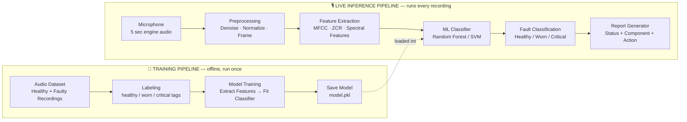
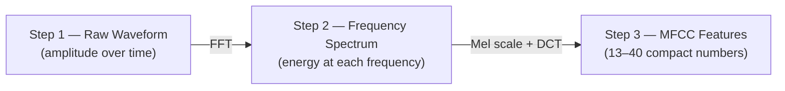
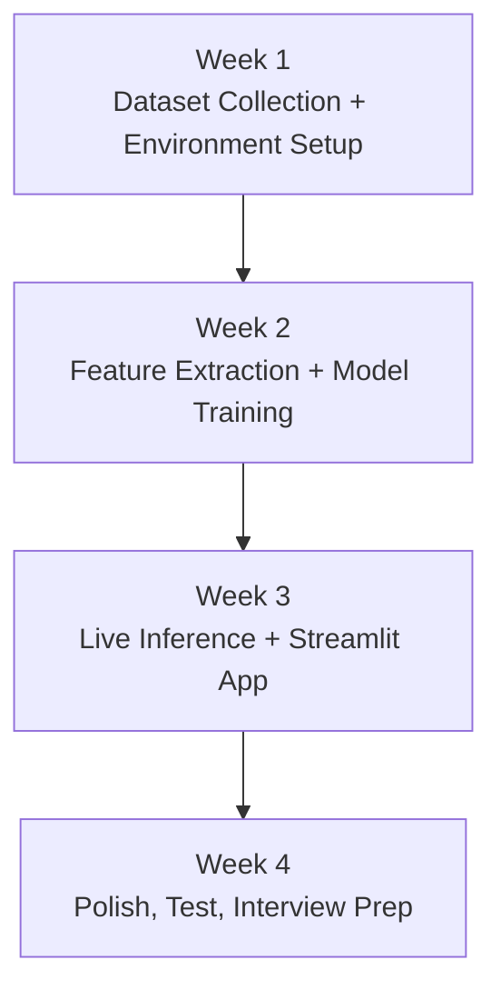

<!-- Theme note: this document is written for a DARK markdown renderer (Obsidian, VS Code dark theme, GitHub dark mode, Typora dark theme, Notion dark mode). Mermaid diagrams auto-adapt to dark backgrounds in all of these. Collapsible <details> blocks below are native interactive elements in GitHub-flavored markdown — click to expand. -->

# 🔧 Engine Whisperer — End-to-End Implementation Blueprint
### Sound-Based Engine Fault Diagnosis System

> *"An experienced CAT technician hears a bad engine and knows. I taught a computer to do the same thing — and it generates the service report automatically."*

**Build time:** ~2–3 weeks · **Difficulty:** Medium · **Domain:** Audio Signal Processing + Classical ML

---

## 📑 Table of Contents

1. [Project Overview](#1-project-overview)
2. [The Core Idea — Why This Works](#2-the-core-idea--why-this-works)
3. [System Architecture](#3-system-architecture)
4. [Project Structure Tree](#4-project-structure-tree)
5. [End-to-End Flow (Narrative Walkthrough)](#5-end-to-end-flow-narrative-walkthrough)
6. [Deep Dive — How Sound Becomes Data](#6-deep-dive--how-sound-becomes-data)
7. [Preprocessing Logic](#7-preprocessing-logic)
8. [Feature Extraction Logic](#8-feature-extraction-logic)
9. [Model Training Logic](#9-model-training-logic)
10. [Live Inference Logic](#10-live-inference-logic)
11. [Fault Classification Taxonomy](#11-fault-classification-taxonomy)
12. [Report Generation Logic](#12-report-generation-logic)
13. [Tools & Libraries Reference](#13-tools--libraries-reference)
14. [Dataset](#14-dataset)
15. [Week-by-Week Build Roadmap](#15-week-by-week-build-roadmap)
16. [The 60-Second Interview Demo Flow](#16-the-60-second-interview-demo-flow)
17. [Business Context — Caterpillar TIS/ADSD Connection](#17-business-context--caterpillar-tisadsd-connection)
18. [Interview Pitch & Q&A Prep](#18-interview-pitch--qa-prep)

---

## 1. Project Overview

**Engine Whisperer** is a system that records **5 seconds** of audio from any running engine or motor and tells the listener three things:

- **Status** — is the engine *Healthy*, *Worn*, or *Critical*?
- **Component** — which part is likely responsible (e.g., a bearing)?
- **Action** — what should a technician check or do next?

It does this by treating engine sound the same way speech-recognition systems treat human speech: convert the raw waveform into a compact numerical "fingerprint," then let a trained classifier recognize which fingerprint pattern it matches.

**The problem it solves:** an experienced mechanic can *hear* a failing bearing or a misfiring cylinder almost instantly. A junior technician usually can't. This project compresses that tacit, years-in-the-field expertise into a $0 tool that runs on a laptop and a microphone — democratizing expert-level diagnostic hearing.

**What you personally learn by building it:** audio signal processing, frequency-domain analysis, supervised pattern classification, and automated fault documentation — skills that map directly onto how real service teams (e.g., Caterpillar's field technicians) diagnose machines.

---

## 2. The Core Idea — Why This Works

Sound is just **air pressure changing over time**. A healthy engine produces a *repetitive, smooth* pressure pattern because all its moving parts are synchronized and balanced. A failing component (a worn bearing, a cracked gear, a knocking piston) introduces **irregular vibration at specific frequencies** that breaks that smoothness.

The entire project is built on one wager: *those irregularities are consistent enough, across many examples, that a machine-learning classifier can learn to recognize them* — the same way it would learn to recognize a spoken word.

Three numerical "ears" are used to capture this irregularity:

| Signal | Plain-English meaning | Healthy engine | Failing engine |
|---|---|---|---|
| **MFCC** | overall frequency "texture" | smooth, repeating pattern | jagged, irregular peaks |
| **ZCR** (Zero Crossing Rate) | how chaotically the waveform oscillates | low — rhythmic | high — erratic, knocking |
| **Spectral Centroid** | "center of mass" of the sound's energy | stays low/stable | shifts upward toward higher frequencies |

Together, these three numbers (plus the MFCC vector) become the *fingerprint* fed into the classifier.

---

## 3. System Architecture

The system is split into **two pipelines** that run at completely different times:

- **Training Pipeline** (offline, done **once**, on your laptop) — builds the brain.
- **Live Inference Pipeline** (online, runs **every time** someone records a sound) — uses the brain.



**Reading the diagram:** every box on the left is built once, fed by a static dataset of labeled recordings. Every box on the right runs in real time whenever a new sound is captured. The **only bridge** between the two pipelines is the saved model file — the live system never re-trains itself; it simply loads the brain that was trained offline and applies it.

---

## 4. Project Structure Tree

A clean folder layout keeps the two pipelines (training vs. live) logically separated, and keeps raw data, processed data, trained artifacts, and application code from bleeding into each other.

```
Auralytics/
│
├── data/
│   ├── raw/                     # Untouched original recordings
│   │   ├── healthy/             # 30+ clips, 3–5 sec each
│   │   ├── worn/                # 30+ clips, 3–5 sec each
│   │   └── critical/            # 30+ clips, 3–5 sec each
│   └── processed/                # Denoised/normalized/framed versions
│       └── features.csv          # Flattened MFCC+ZCR+centroid vectors + labels
│
├── models/
│   └── model.pkl                 # Trained classifier, produced once by the training pipeline
│
├── src/
│   ├── preprocessing/             # Denoise, normalize, frame-split logic
│   ├── feature_extraction/        # MFCC, ZCR, spectral centroid computation
│   ├── training/                  # Train/test split, fit classifier, evaluate, save model
│   ├── inference/                 # Load model, classify a new clip, get confidence score
│   └── reporting/                 # Map fault class → component → recommended action
│
├── app/
│   └── streamlit_app/             # Record button, waveform + MFCC heatmap display, result card
│
├── notebooks/                     # Exploration: visualize waveforms, MFCCs, confusion matrix
│
├── docs/
│   └── implementation.md          # (this document)
│
└── requirements.txt                # librosa, sounddevice, scikit-learn, joblib, streamlit
```

**Why this structure:**

- `data/raw` vs `data/processed` separates "what was recorded" from "what was computed" — so preprocessing can be re-run without re-recording.
- `models/` holds only the artifact that bridges training → inference. It is the single hand-off point in the entire architecture.
- `src/` is split by **pipeline stage**, not by file type — each subfolder corresponds exactly to one box in the architecture diagram above, so the code structure mirrors the system diagram one-to-one.
- `app/` is kept separate from `src/` because it's a *presentation* layer — it calls into `inference/` and `reporting/` rather than containing diagnostic logic itself.

---

## 5. End-to-End Flow (Narrative Walkthrough)

<details>
<summary><strong>🧪 Training Flow (click to expand)</strong></summary>

1. **Collect** healthy and faulty audio clips into three labeled folders.
2. **Preprocess** every clip identically: reduce noise, normalize volume, split into overlapping 1-second frames.
3. **Extract features** from every frame: MFCC vector + ZCR value + spectral centroid value, flattened into one numeric row.
4. **Split** the full set of rows into training (80%) and testing (20%) subsets.
5. **Fit** a classifier (Random Forest, or SVM as an alternative) on the training rows and their healthy/worn/critical labels.
6. **Evaluate** accuracy on the held-out test rows; target >85%.
7. **Persist** the fitted classifier to disk as `model.pkl` so it never needs to be retrained for every new recording.

</details>

<details>
<summary><strong>🎙️ Live Inference Flow (click to expand)</strong></summary>

1. **Capture** 5 seconds of audio from the microphone.
2. **Preprocess** it with the *exact same* steps used during training (denoise, normalize, frame) — consistency here is critical, or the classifier will see unfamiliar input shapes.
3. **Extract** the same MFCC/ZCR/spectral-centroid feature vector from the live clip.
4. **Load** the previously saved `model.pkl` and feed it the feature vector.
5. **Receive** a predicted class (Healthy / Worn / Critical) plus a confidence percentage.
6. **Generate** a short report: timestamp, status, the component most likely responsible, and a recommended next action.
7. **Display** the result — and optionally the MFCC heatmap — in the Streamlit UI.

</details>

The two flows share *identical* preprocessing and feature-extraction logic on purpose: a classifier can only correctly recognize a live sound if it was transformed into numbers the exact same way the training sounds were.

---

## 6. Deep Dive — How Sound Becomes Data

This is the conceptual core of the entire project. Three transformations turn an audio wave into something a classifier can reason about:



**Step 1 — Raw waveform.** A microphone records amplitude (air pressure) at thousands of samples per second. This is the "what you'd see on an oscilloscope" view — too noisy and too high-dimensional for a classifier to use directly.

**Step 2 — Frequency spectrum (via FFT).** The Fast Fourier Transform re-expresses the same signal not as *amplitude over time* but as *how much energy exists at each frequency*. This reveals patterns invisible in the raw waveform — for example, a bearing wear vibration tends to concentrate energy at specific frequency bands.

**Step 3 — MFCC features (via Mel scale + DCT).** Human hearing isn't linear — we're far more sensitive to differences in low frequencies than high ones. The **Mel scale** re-warps the frequency spectrum to match that human sensitivity curve. A **Discrete Cosine Transform (DCT)** is then applied to compress that warped spectrum into a small set of 13–40 numbers that summarize the sound's overall "texture" extremely compactly.

**What the classifier actually "sees":**

| | Pattern |
|---|---|
| Healthy engine | smooth, evenly-spaced MFCC bars — a *regular, repeating* fingerprint |
| Faulty engine (bearing wear) | irregular, spiky MFCC bars — peaks appear at specific, inconsistent positions |

Different fault types produce **different MFCC fingerprints**. The classifier's entire job during training is to learn the boundary between these fingerprint shapes.

---

## 7. Preprocessing Logic

Every audio clip — whether part of the training dataset or a brand-new live recording — passes through the same three preprocessing steps before any feature is computed:

1. **Noise reduction** — strips background hiss/hum so the signal reflects the engine, not the room.
2. **Amplitude normalization** — rescales volume so a quiet recording and a loud recording of the *same* fault produce comparable feature values. Without this, "loudness" could accidentally become a confounding signal instead of the actual fault pattern.
3. **Framing** — the clip is split into overlapping 1-second windows (50% overlap). Framing matters because faults aren't always present uniformly across all 5 seconds — overlapping windows give the model multiple "looks" at the same clip and increase the effective amount of training data per recording.

The output of preprocessing is a set of clean, comparable, fixed-length frames — ready for feature extraction.

---

## 8. Feature Extraction Logic

For every preprocessed frame, three pieces of information are computed and combined into a single flat numeric vector:

- **MFCC vector** (13 coefficients) — the frequency "texture" fingerprint described above.
- **ZCR (Zero Crossing Rate)** — counts how many times the waveform crosses the zero-amplitude line per second. A rhythmic, healthy engine crosses zero predictably (low ZCR). A knocking, erratic engine crosses zero chaotically (high ZCR). This is cheap to compute but surprisingly informative as a *sanity check* feature alongside MFCC.
- **Spectral Centroid** — the "center of mass" of the frequency spectrum, i.e., where most of the sound's energy is concentrated. A worn or failing bearing tends to push energy toward higher frequencies, so this value rises as wear increases.

These three pieces are **flattened into one 1D feature vector per frame** — this is the row of numbers that the classifier actually trains on (during training) or classifies (during inference). Every frame from every clip becomes one row in the training table; the label column is the folder it came from (healthy / worn / critical).

---

## 9. Model Training Logic

1. **Input:** the table of flattened feature vectors (rows) with their healthy/worn/critical labels.
2. **Split:** 80% of rows go to training, 20% are held back for testing — this ensures the reported accuracy reflects performance on examples the model has never seen.
3. **Choice of classifier:** a **Random Forest** is the default choice — it handles tabular numeric features well, is robust to noisy data, doesn't require feature scaling, and gives an easy-to-explain "majority vote of many decision trees" intuition for an interview setting. An **SVM** is mentioned as a viable alternative if a cleaner decision boundary is preferred.
4. **Fit:** the classifier learns the relationship between feature-vector shape and fault label.
5. **Evaluate:** accuracy is measured on the held-out 20% test split; the target benchmark is **>85% accuracy**. A confusion matrix should also be generated — it shows *which* fault classes get confused with each other, which is valuable both for debugging and for the interview presentation.
6. **Persist:** the fitted model object is serialized to disk (`model.pkl`) so the live inference pipeline can load it instantly without ever re-running training.

---

## 10. Live Inference Logic

1. A 5-second clip is captured live from the microphone.
2. It passes through the **identical** preprocessing and feature extraction logic used in training (Sections 7–8) — this consistency is what makes the comparison between live audio and trained patterns valid.
3. The resulting feature vector is handed to the loaded model.
4. The model returns a predicted class **and** a confidence percentage (how strongly it believes in that prediction relative to the alternatives).
5. The predicted class, together with which underlying feature most strongly drove the decision (e.g., an elevated spectral centroid), is passed forward into the report generator.

---

## 11. Fault Classification Taxonomy

| Class | Acoustic signature | Real-world meaning |
|---|---|---|
| **Healthy** | All frequency patterns within normal range; regular rhythm; consistent, smooth MFCC | No issues detected — normal operation |
| **Worn** | Slight increase in high-frequency energy; occasional irregular spikes in the MFCC pattern | Early-stage bearing wear — not urgent, but worth scheduling a check |
| **Critical** | Chaotic MFCC pattern; high ZCR; spectral centroid sharply elevated | Seized bearing or cracked gear — urgent, stop-and-inspect situation |

This taxonomy is intentionally simple (three classes) so the model has a realistic chance of reaching high accuracy with a modest, self-collected dataset — and so the resulting report is immediately actionable for a technician rather than requiring further interpretation.

---

## 12. Report Generation Logic

The report generator's job is to translate a raw classifier output into language a technician can act on immediately. Its logic combines three signals:

- **Status** — directly the predicted class (Healthy / Worn / Critical).
- **Component flagged** — inferred from *which* underlying feature pattern dominated the classification (e.g., a sharply elevated spectral centroid combined with high ZCR points toward a bearing rather than, say, a fuel-system issue).
- **Recommended action** — a simple mapping from status to next step:
  - *Healthy* → no action needed, continue normal monitoring.
  - *Worn* → flag for scheduled inspection of the suspected component.
  - *Critical* → recommend immediate stop-and-inspect.

The report also includes a **timestamp**, so a series of recordings over time can later be compared to show degradation trends — directly mirroring how a real service log is built up over a machine's operating life.

---

## 13. Tools & Libraries Reference

| Library | Role in the pipeline |
|---|---|
| **librosa** | Core signal-processing library — loads audio files, computes MFCC, ZCR, and spectral features |
| **sounddevice** | Captures live microphone audio in real time for the inference pipeline |
| **scikit-learn** | Trains the Random Forest (or SVM) classifier, performs the train/test split, measures accuracy |
| **joblib** | Saves and loads the trained model object to/from disk |
| **streamlit** | Builds the live web UI (record button, waveform, result card) with no HTML/CSS required |
| **matplotlib** | Visualizes waveforms, MFCC heatmaps, and the confusion matrix for the presentation |

---

## 14. Dataset

The **CWRU Bearing Fault Dataset** (Case Western Reserve University) is the recommended starting dataset — it is free, academic, and contains real motor fault recordings across three fault types at multiple severity levels, which maps naturally onto the Healthy/Worn/Critical taxonomy used here.

It is recommended to **supplement** this dataset with self-recorded clips (e.g., a small fan motor recorded in both a healthy and an artificially stressed state) — this adds variety in recording conditions (different microphone, different room acoustics) and helps the model generalize beyond a single, clean academic dataset.

---

## 15. Week-by-Week Build Roadmap



<details>
<summary><strong>Week 1 — Dataset collection + environment setup</strong></summary>

- **Setup:** install Python, librosa, scikit-learn, streamlit; test microphone recording.
- **Dataset:** download the CWRU Bearing Dataset; also record your own (e.g., a fan motor in healthy vs. stressed states).
- **Labels:** create three folders — `/healthy`, `/worn`, `/critical` — each with 30+ clips of 3–5 seconds.
- ✅ **End of week:** 90+ labeled audio files ready to use.

</details>

<details>
<summary><strong>Week 2 — Feature extraction + model training</strong></summary>

- **Preprocessing:** load each clip, apply noise reduction, normalize amplitude, split into 1-second frames with 50% overlap.
- **MFCC:** compute MFCC (13 coefficients) plus ZCR and spectral centroid; flatten into one feature vector per clip.
- **Train:** feed feature vectors + labels into a Random Forest with an 80/20 train-test split; save the fitted model.
- ✅ **End of week:** trained model saved, accuracy >85% on the test set.

</details>

<details>
<summary><strong>Week 3 — Live inference + Streamlit app</strong></summary>

- **Live record:** add real-time microphone capture (5-second clip); feed it directly into the same preprocessing/feature pipeline.
- **UI:** build the Streamlit app — record button → waveform display → result card showing status and confidence %.
- **Report:** auto-generate a report containing timestamp, status, flagged component, and recommended action.
- ✅ **End of week:** a working app that records and diagnoses live.

</details>

<details>
<summary><strong>Week 4 — Polish, test, and interview prep</strong></summary>

- **Test:** validate against YouTube engine-fault videos; document accuracy; prepare a confusion matrix for the presentation.
- **Visuals:** add an MFCC heatmap visualization to the app so an interviewer can see exactly what the model "sees."
- **Demo script:** rehearse the 60-second demo (open app → record faulty engine audio → show report → explain the pipeline) until it's muscle memory.

</details>

---

## 16. The 60-Second Interview Demo Flow


**The one-line explanation to deliver at the final step:**

> "The system recorded 5 seconds of audio, converted it to an MFCC fingerprint, and the trained model matched it to bearing wear — the same way a technician listens before opening the service manual."

---

## 17. Business Context — Caterpillar TIS/ADSD Connection

This project intentionally mirrors a real diagnostic workflow used in heavy-equipment service:

- **ADSD** (Application & Development Systems Division-style validation work) validates machine performance and documents how machines behave under stress.
- **TIS** (Technical Information Systems) documents exactly the kind of question this project answers: *what does a worn bearing sound like, and what should a technician check first?*
- Engine Whisperer captures the **exact moment** a machine begins to fail — which is precisely the kind of raw signal that feeds into both performance validation records and service bulletins. In the language of the original pitch: *"You're at the source."*

---

## 18. Interview Pitch & Q&A Prep

**The elevator pitch (memorize this):**

> "I built Engine Whisperer — a system that records 5 seconds of any running motor, extracts MFCC features the way speech recognition does, and classifies the fault type. It's directly solving what Caterpillar's TIS team documents: what does a worn bearing sound like, and what should a technician check first? I automated the listen-and-diagnose step."

<details>
<summary><strong>❓ "What is MFCC, in one sentence?"</strong></summary>

A compact set of 13–40 numbers that summarize a sound's frequency "texture," weighted to match how human ears actually perceive pitch (more sensitive to low frequencies than high).

</details>

<details>
<summary><strong>❓ "Why Random Forest instead of a deep neural network?"</strong></summary>

With a small, self-collected dataset (tens to low hundreds of clips), a Random Forest is more data-efficient, doesn't require GPU training, resists overfitting better, and is far easier to explain in an interview ("a vote among many simple decision trees") than a neural architecture would be.

</details>

<details>
<summary><strong>❓ "Why do ZCR and spectral centroid matter if MFCC already captures frequency texture?"</strong></summary>

They're cheap, highly interpretable "sanity check" signals that reinforce the MFCC pattern — ZCR directly captures rhythm/erraticness, and spectral centroid directly captures the energy shift toward higher frequencies that's characteristic of bearing wear. Together they make the classifier's decision more robust and easier to explain.

</details>

<details>
<summary><strong>❓ "How would you improve this beyond the prototype?"</strong></summary>

Talking points: collect a larger and more diverse dataset (more engine types, more recording conditions), add more granular severity levels instead of just three classes, track trends over multiple recordings of the same machine over time, and validate against real field technician judgments to calibrate the confidence score.

</details>

---

### ✅ Summary

Engine Whisperer is a complete, two-pipeline audio classification system: an **offline training pipeline** that turns a labeled dataset of engine recordings into a saved model, and a **live inference pipeline** that captures a new 5-second clip, runs it through the identical preprocessing and feature-extraction steps, classifies it, and generates a human-readable service report — all built on the core insight that a fault leaves a recognizable fingerprint in a sound's MFCC, ZCR, and spectral centroid values.
