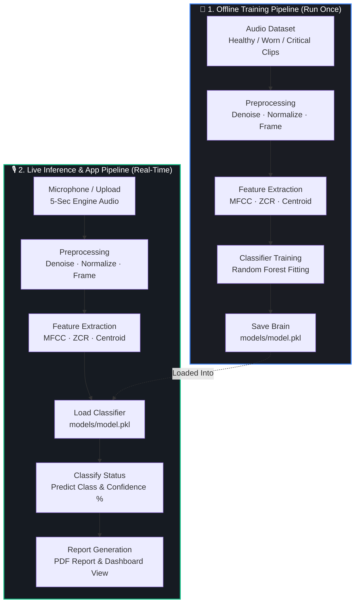

# 🔧 Auralytics — Sound-Based Engine Fault Diagnosis System

> *"An experienced mechanical technician hears a running engine and instantly knows its health. Auralytics captures that intuitive, field-proven expertise and replicates it inside an intelligent computer-audition system."*

Auralytics is an end-to-end, machine-learning-powered acoustic diagnostic platform. By capturing just **5 seconds of engine or motor audio**, the system automatically preprocesses the sound, extracts key spectral features, classifies the engine's status, and generates a structured, printable PDF maintenance report.

---

## 🗺️ System Architecture

Auralytics features a two-phase architecture: an **offline training pipeline** to build and evaluate the classification model, and a **live inference pipeline** integrated with a real-time Streamlit dashboard.



---

## 📁 Project Directory Layout

```
Auralytics/
│
├── app/
│   └── streamlit_app/
│       ├── app.py              # Main dashboard frontend interface
│       └── .streamlit/
│           └── config.toml     # Dark-theme configuration settings
│
├── data/
│   ├── raw/
│   │   ├── healthy/            # Raw .wav audio for healthy engines
│   │   ├── worn/               # Raw .wav audio for worn engines (early wear)
│   │   └── critical/           # Raw .wav audio for critical engines (severe failure)
│   └── processed/
│       └── features.csv        # Extracted features table used in training
│
├── models/
│   └── model.pkl               # Serialized trained Random Forest classifier
│
├── src/
│   ├── preprocessing/          # Noise reduction, normalization, and window framing
│   ├── feature_extraction/     # MFCC, Zero Crossing Rate (ZCR), Spectral Centroid
│   ├── training/               # Model training and validation pipelines
│   ├── inference/              # Loaded model deployment & prediction logic
│   └── reporting/              # Custom PDF report generation & troubleshooting guides
│
├── Docs/
│   └── implementation.md       # Exhaustive architecture implementation blueprint
│
├── requirements.txt            # Python dependencies (librosa, sklearn, streamlit, etc.)
├── packages.txt                # System packages for Streamlit Community Cloud (ffmpeg)
├── runtime.txt                 # Specifies Python version (3.11)
└── .gitignore                  # Excludes caches, temporary audio files, and local settings
```

---

## 🧠 Core Processing Pipeline: How Sound Becomes Data

To classify complex machine audio, raw pressure waves must be converted into structured features that a classification algorithm can interpret. Auralytics accomplishes this in three steps:

### 1. Preprocessing
*   **Spectral Denoising:** Utilizes stationary noise reduction (via `noisereduce`) to strip out background environmental hiss, hum, and noise.
*   **Amplitude Normalization:** Peak-normalizes the raw signal to the $[-1, 1]$ range. This ensures that the distance from the microphone or recording volume does not affect the prediction.
*   **Frame Splitting:** Splits the 5-second recording into overlapping 1-second frames with a 50% overlap, yielding 9 analysis frames per recording. This increases training samples and provides micro-audits across the file.

### 2. Feature Extraction
For every single 1-second frame, Auralytics extracts a **15-dimensional numeric vector**:
*   **MFCCs (13 coefficients):** Mel-Frequency Cepstral Coefficients represent the spectral envelope and frequency "texture" of the sound, mimicking human hearing curves.
*   **Zero Crossing Rate (ZCR) (1 value):** The rate at which the sound wave transitions across the zero amplitude axis. Erratic knocking engines display a highly irregular and elevated ZCR.
*   **Spectral Centroid (1 value):** The "center of mass" of the sound frequencies. High-frequency friction from worn components or micro-fractured bearings shifts this centroid upward.

### 3. Classification
A **Random Forest Classifier** evaluates the features of all frames and performs a majority-vote classification across the 1-second frames.
*   **Healthy:** Balanced frequency envelope, normal ZCR, stable centroid. (Technician Action: Continue routine monitoring).
*   **Worn:** Mild high-frequency spikes, elevated centroid. (Technician Action: Schedule a bearing/piston inspection within 14 days).
*   **Critical:** Extremely chaotic MFCC texture, high ZCR, sharp centroid spike. (Technician Action: Immediate emergency shutdown & teardown).

---

## ⚙️ Running and Testing Locally

Follow these precise steps to extract, set up, and run the project on your local system:

### 📋 Prerequisites
*   **Python 3.11** installed. You can download it from [python.org](https://www.python.org/downloads/).
*   **Git** (optional, for cloning).

---

### 🚀 Setup Steps

#### Step 1: Extract or Clone the Repository
If you downloaded this project as a ZIP archive, extract it to a directory of your choice. Alternatively, clone it using Git:
```bash
git clone https://github.com/mkeerthana-08/Auralytics.git
cd Auralytics
```

#### Step 2: Create a Virtual Environment
It is highly recommended to isolate your dependencies using a Python virtual environment:
*   **On Windows:**
    ```powershell
    python -m venv .venv
    .venv\Scripts\activate
    ```
*   **On macOS / Linux:**
    ```bash
    python3 -m venv .venv
    source .venv/bin/activate
    ```

#### Step 3: Install Required Dependencies
Install the required packages listed in `requirements.txt`:
```bash
pip install -r requirements.txt
```
> ⚠️ **Note for Linux users:** You might need to install `portaudio` and `ffmpeg` via your system package manager if `sounddevice` or `librosa` encounters errors:
> ```bash
> sudo apt-get update && sudo apt-get install portaudio19-dev ffmpeg -y
> ```

#### Step 4: Train the Classification Model
A pre-trained model file may not be included in the repository to keep the repository light. You can generate a synthetic demo dataset and train the model immediately by running:
```bash
python -m src.training.train_runner --synthetic
```
This script generates realistic synthetic training audio features, trains a Random Forest model, and saves the serialized model directly into `models/model.pkl`.

#### Step 5: Launch the Streamlit Web Application
Launch the interactive web dashboard:
```bash
streamlit run app/streamlit_app/app.py
```
After running this command, your default browser will open automatically and load the application interface at `http://localhost:8501`.

---

## 🌐 Public Cloud Deployment

The repository is fully configured for deployment on the **Streamlit Community Cloud**:
1. Fork or push this repository to your public GitHub account.
2. Log into [share.streamlit.io](https://share.streamlit.io/) with your GitHub credentials.
3. Click **New App**, then select your repository, branch, and set the main file path to:
   ```
   app/streamlit_app/app.py
   ```
4. Click **Deploy**. Streamlit will automatically read `packages.txt` to install the `ffmpeg` system package, install all Python packages from `requirements.txt`, and start the app. The app automatically trains the classification model on its first run if `models/model.pkl` is not found.

---

## 📄 License
This project is licensed under the MIT License — see the LICENSE file for details.
