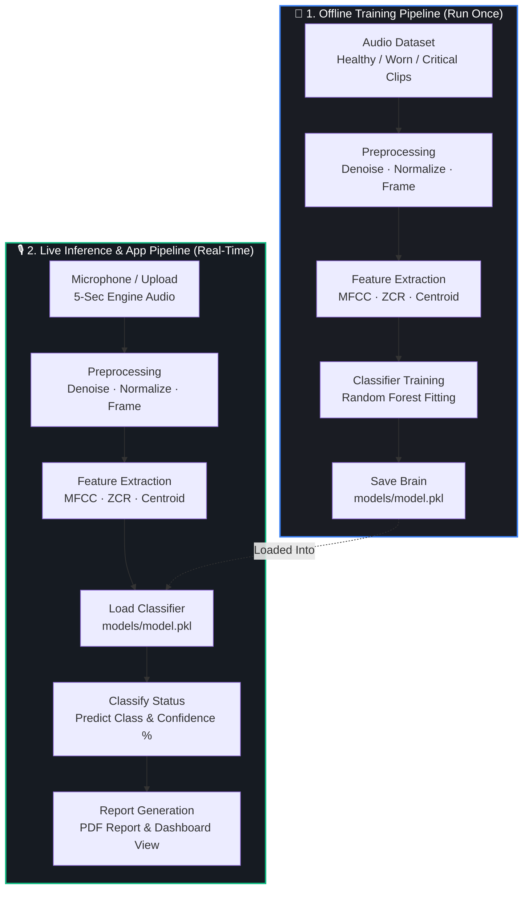

# 🔧 Auralytics — Sound-Based Engine Fault Diagnosis System

## 📝 Project Overview
Auralytics is an end-to-end, machine-learning-powered acoustic diagnostic platform. By capturing just **5 seconds of engine or motor audio**, the system automatically preprocesses the sound, extracts key spectral features, classifies the engine's status, and generates a structured, printable PDF maintenance report.

## 🗺️ Architecture
Auralytics features a two-phase architecture: an **offline training pipeline** to build and evaluate the classification model, and a **live inference pipeline** integrated with a real-time Streamlit dashboard.



## ✨ Features
*   **Audio Recording & Upload:** Record 5 seconds of motor audio or upload pre-recorded `.wav` files.
*   **Acoustic Preprocessing:** Automated spectral denoising (via `noisereduce`), peak-normalization, and overlap-framing.
*   **Advanced Feature Extraction:** Extracts MFCCs, Zero Crossing Rate (ZCR), and Spectral Centroid parameters.
*   **Intelligent Classifier:** Random Forest model with confidence probability prediction (Healthy / Worn / Critical).
*   **Auto-generated Reports:** Automatically compile analysis results into a clean, printable PDF diagnostics/maintenance report.

## ⚙️ Installation & Cloning

### Setup Steps
1. **Clone the Repository:**
   ```bash
   git clone https://github.com/mkeerthana-08/Auralytics.git
   cd Auralytics
   ```
2. **Create and Activate a Virtual Environment:**
   * **Windows (PowerShell):**
     ```powershell
     python -m venv .venv
     .venv\Scripts\activate
     ```
   * **macOS / Linux:**
     ```bash
     python3 -m venv .venv
     source .venv/bin/activate
     ```
3. **Install Dependencies:**
   ```bash
   pip install -r requirements.txt
   ```
4. **Train the Classification Model:**
   ```bash
   python -m src.training.train_runner --synthetic
   ```
5. **Run the Application Dashboard:**
   ```bash
   streamlit run app/streamlit_app/app.py
   ```

## 📖 Documentation
Detailed architecture designs and implementation specifications are located in the [Docs/implementation.md](Docs/implementation.md) file.
